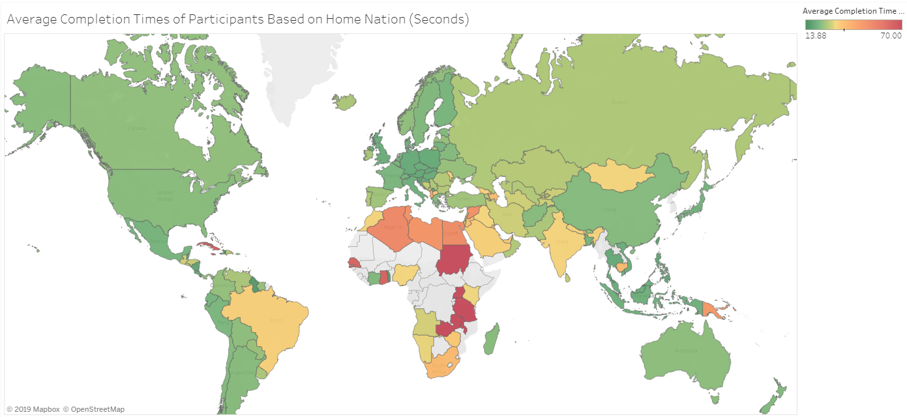

# Rusults from the World Rubik's Cube Association
# r/dataisbeautiful's DataViz Battle for November 2019

[Average Completion Times of Participants Based on Home Nation (Seconds)](https://public.tableau.com/profile/andrew.grattendick#!/vizhome/AverageCompletionTimesofParticipantsBasedonHomeNation/Sheet1)

## Background
November 2019 Reddit's r/dataisbeautiful's DataViz Battle deals with a massive data set from the World Rubick's Cube Association. This data set includes information about participants, different types of events, and completion data for all of the above.

## Data Collection
The data was avaiable in two different methods. One SQL text file or over a dozen TSV files. With the size of the data set, SQL would make data exploration much easier.

## Data Analysis
There were many possible avenues to explore here, but the most interesting seemed to be just simple completion times by participants and to see who was the fastest on average. With over 140,000 participants that visualization would be difficult to read. So instead of average completion time by participants the graph shows average completion time by participant's home nation. This also provided an opportunity to use a color graphic with a map. The SQL query was fairly simple and is included in this repo. Finally the new table was exported into a CSV file.

## Charting
Tableau Public was used to chart the data. Map was the chosen display format and the Average Completion Time was the data for the color scale. Unfortunately the data has a long tail to the right, so the color map has a bunch of green and only two red nations. Some quick calculatins were run in Excel to find the min, max, avg, and stdev of the completion time data. With that information the color center was adjusted to the average, and the maximum color was adjusted to average + (2*stdev). This provided a better color balance, showing the various average times.

Finally, the completion times were provided in centiseconds, so a new measure was calculated dividing all numbers by 100 to show completion time in seconds.

## Notes
While it took some time to get the SQL running smoothly, most of the data work was accomplished quickly, so this repo only has a few commits.

Due to the size of the SQL text file, and that it's also linked below, it's not a part of this repo.

## Links
[r/dataisbeautiful DataViz Battle for November 2019](https://www.reddit.com/r/dataisbeautiful/comments/drgz68/battle_dataviz_battle_for_the_month_of_november/)  
[WCA results export](https://www.worldcubeassociation.org/results/misc/export.html)

